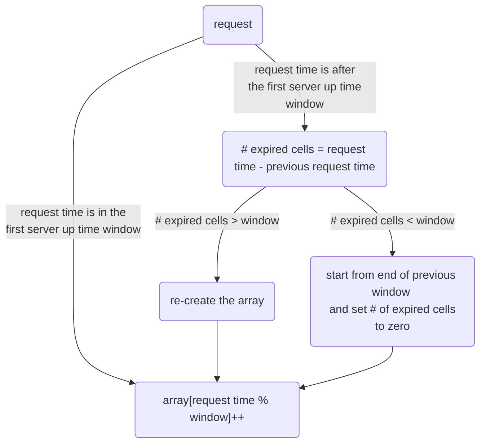

# [simplesurance](https://www.simplesurance.com/) by Allianz Golang Coding Challenge

## Description

Using only the standard library, create a Go HTTP server that on each request responds with a
counter of the total number of requests that it has received during the previous 60 seconds
(moving window). The server should continue to return the correct numbers after restarting it, by
persisting data to a file.
When you’re done, please share your solution with me, and I’ll ask our Tech Team to review it.

- **Deadline**: Feel free to do it at your own pace, but, to give you an overview, candidates usually
  take up to 3 days to complete the task.
- **Submission**: We accept your task via GitHub, GitLab or any Git-based Software. Please also
  share how much time was needed to finish the task.
- **Review**: We ask for 2 to 3 days to review your results.

## How to Build and Run

This guide assumes you have Go installed on your system. If not, please [install Go](https://golang.org/doc/install)
first.

### Build

1. Open a terminal.
2. Navigate to the directory containing the source code of the project.
   If the source code is in your current directory, you can skip this step.
3. Compile the project by executing the following command:

```bash
go build
```

This will build the executable from the source files. If successful, an executable file
will be created in the current directory.

### Run

After building the project,
you can run the executable directly from the command line:

```bash
./simplesurance-assignment
```

If you are using Windows, you can run the executable without the `./`:

```powershell
simplesurance-assignment.exe
```

## Implementation

There are different algorithms to implement with their own pros and cons. The simplest approach is implementing
a deque (double ended queue) in which I was concerned about the potential growth in the deque's size relative to the 
volume of requests and also though the amortized time complexity will be O(1) but some requests may take much longer 
than the others so, I implemented another algorithm which I'm going to explain besides the rest of code and take a look 
at why each decision was made.

In the current implementation we are using a fixed-window-size array in which each room indicates the number of requests
queried in the corresponding second (I've discretized time into one-second intervals, if the code were to be used in 
contexts such as microprocessors, where finer time resolution is needed, we would need to adapt and refine our approach). 
To return the response we simply sum up the numbers in this array. To write
each request to this array we follow below procedure.



This solution has O(1) memory and time complexity.

## Saving to Disk

Writing into a file using the current solution is easy. We write
the array using JSON format into a file which is named `state.json` by default.
Then read the file in the start phase and if there was any error we fall back to use
an empty state.

About how often we want to write to this file we should answer to these question: "How important is consistency?" and
"How important is availability?" If consistency is so important in this case we may choose to write to the file by each 
and every request but since writing to a file is so time-consuming and may affect availability under high load, instead 
I started another goroutine which writes to the file periodically (period is configurable), this approach has better 
performance.

## Load test results

```

          /\      |‾‾| /‾‾/   /‾‾/   
     /\  /  \     |  |/  /   /  /    
    /  \/    \    |     (   /   ‾‾\  
   /          \   |  |\  \ |  (‾)  |
  / __________ \  |__| \__\ \_____/ .io

execution: local
script: loadtest.js
output: -

scenarios: (100.00%) 1 scenario, 100 max VUs, 1m0s max duration (incl. graceful stop):
* default: 100 looping VUs for 30s (gracefulStop: 30s)


     ✓ success

     checks.........................: 100.00% ✓ 3000      ✗ 0    
     data_received..................: 332 kB  11 kB/s
     data_sent......................: 240 kB  8.0 kB/s
     http_req_blocked...............: avg=85.63µs  min=1µs  med=4µs    max=3.34ms p(90)=9µs     p(95)=25.04µs 
     http_req_connecting............: avg=79.08µs  min=0s   med=0s     max=2.81ms p(90)=0s      p(95)=0s      
     http_req_duration..............: avg=1.78ms   min=87µs med=1.66ms max=8.57ms p(90)=3.17ms  p(95)=3.8ms   
       { expected_response:true }...: avg=1.78ms   min=87µs med=1.66ms max=8.57ms p(90)=3.17ms  p(95)=3.8ms   
     http_req_failed................: 0.00%   ✓ 0         ✗ 3000 
     http_req_receiving.............: avg=45.77µs  min=4µs  med=18µs   max=6.21ms p(90)=60µs    p(95)=141.04µs
     http_req_sending...............: avg=136.89µs min=3µs  med=12µs   max=6.81ms p(90)=424.1µs p(95)=779.09µs
     http_req_tls_handshaking.......: avg=0s       min=0s   med=0s     max=0s     p(90)=0s      p(95)=0s      
     http_req_waiting...............: avg=1.6ms    min=63µs med=1.49ms max=6.87ms p(90)=2.88ms  p(95)=3.3ms   
     http_reqs......................: 3000    99.675063/s
     iteration_duration.............: avg=1s       min=1s   med=1s     max=1.01s  p(90)=1s      p(95)=1s      
     iterations.....................: 3000    99.675063/s
     vus............................: 100     min=100     max=100
     vus_max........................: 100     min=100     max=100


running (0m30.1s), 000/100 VUs, 3000 complete and 0 interrupted iterations
default ✓ [======================================] 100 VUs  30s
```

On a 2021 M1 Macbook Pro
